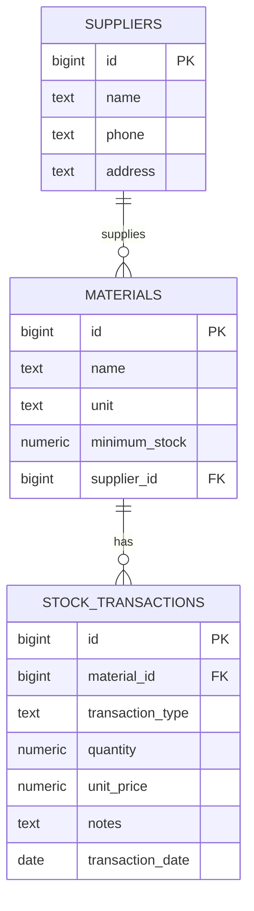

# ERD Bunberry Bakery

```mermaid
erDiagram
    SUPPLIERS ||--o{ MATERIALS : supplies
    MATERIALS ||--o{ STOCK_TRANSACTIONS : has

    SUPPLIERS {
        bigint id PK
        text name
        text phone
        text address
    }
    MATERIALS {
        bigint id PK
        text name
        text unit
        numeric minimum_stock
        bigint supplier_id FK
    }
    STOCK_TRANSACTIONS {
        bigint id PK
        bigint material_id FK
        text transaction_type
        numeric quantity
        numeric unit_price
        text notes
        date transaction_date
    }
```

Stok berjalan dihitung dengan rumus: total transaksi `IN` dikurangi total transaksi `OUT` untuk setiap bahan.
